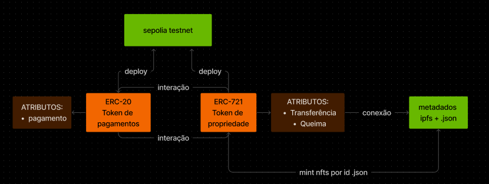

## ERC-20

O projeto RENT é uma iniciativa que visa fornecer um meio de autenticação robusto e confiável para transações financeiras dentro da plataforma Crypto Home. Para alcançar esse objetivo, o RENT é implementado como um token ERC-20, construído sobre a infraestrutura da blockchain Ethereum.

## ERC-721

O projeto Crypto Home NFTs é uma iniciativa que busca representar cada imóvel mintado como um token não fungível (NFT) na blockchain Ethereum. Esses NFTs servem como uma forma única e autêntica de identificar e transacionar propriedades dentro da plataforma Crypto Home. Além disso, para facilitar a interação financeira entre os usuários e os imóveis, os NFTs são projetados para se integrarem perfeitamente com o token ERC-20 denominado RENT.

### Tecnologias Utilizadas:

- **Framework:** Froundry
- **SmartContracts:** Solidity

