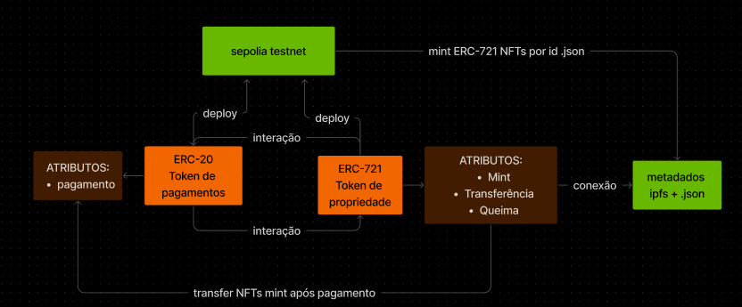

### ERC-20

O projeto RENT é uma iniciativa que visa fornecer um meio de autenticação robusto e confiável para transações financeiras dentro da plataforma Crypto Home. Para alcançar esse objetivo, o RENT é implementado como um token ERC-20, construído sobre a infraestrutura da blockchain Ethereum.

### ERC-721

O projeto Crypto Home NFTs é uma iniciativa que busca representar cada imóvel mintado como um token não fungível (NFT) na blockchain Ethereum. Esses NFTs servem como uma forma única e autêntica de identificar e transacionar propriedades dentro da plataforma Crypto Home. Além disso, para facilitar a interação financeira entre os usuários e os imóveis, os NFTs são projetados para se integrarem perfeitamente com o token ERC-20 denominado RENT.

### Tecnologias Utilizadas:

- **Framework:** Froundry
- **SmartContracts:** Solidity

### ROADMAP:

- **criação do token ERC20** - Implementado
- **criação do token ERC721 com garantia de propriedade NFT para owner do contrato** - Implementado
- **permissão para mintar NFts a partir dos metadados do arquivo .json** - Implementado
- **permissão para transferência de nfts mintados para usuário que vai locar imóvel** - Trabalhando nisso
- **garantir que a transferência de nfts mintados para o usuário só será possível mediante pagamento de aluguel com ERC-20** - Trabalhando nisso
- **permissão para queima de tokens ao final do contrato de aluguel** - Trabalhando nisso
- **testes e deploy na rede** - Em breve -
- **implementação com template e front end** - Em breve

### MODELAGEM ARQUITETURA:

### DEPLOY

- **RENT ADDRESS:** 0xDC4A99B156E007BB35C124127856f32740FbF4f7
- **NFT_RENT ADDRESS:-** 0x857CB9e748049D6D33db390330978E676405d5b5
