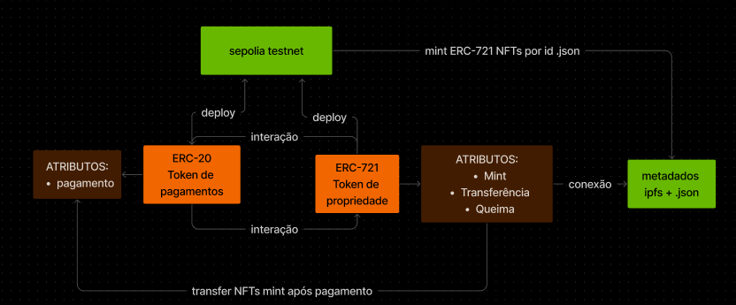

<h1 align="center">CryptoHome Contracts</h1>

<h3 align="center">Infraestrutura blockchain para locação descentralizada de imóveis</h3>

  <code>ERC-20</code> &nbsp;•&nbsp; <code>ERC-721</code> &nbsp;•&nbsp; <code>Solidity</code> &nbsp;•&nbsp; <code>Foundry</code>

---

## 📌 Visão Geral

Este repositório contém os contratos inteligentes que sustentam a plataforma **CryptoHome** —
uma solução descentralizada para locação de imóveis na blockchain Ethereum.

A arquitetura é composta por dois contratos principais que trabalham em conjunto:

---

## 🪙 RENT — Token ERC-20

Token de utilidade da plataforma CryptoHome, usado como meio de pagamento nas transações
de aluguel entre locadores e locatários.

- Autenticação robusta de transações financeiras on-chain
- Integrado nativamente ao contrato NFT para validar pagamentos
- Construído sobre a infraestrutura da Ethereum

**Deploy:** `0xDC4A99B156E007BB35C124127856f32740FbF4f7`

---

## 🏠 CryptoHome NFTs — Token ERC-721

Cada imóvel cadastrado na plataforma é representado como um NFT único na blockchain,
garantindo autenticidade, rastreabilidade e propriedade verificável.

- Mint de NFTs a partir de metadados `.json`
- Transferência de NFT ao locatário condicionada ao pagamento em RENT (ERC-20)
- Queima do token ao encerramento do contrato de aluguel
- Integração nativa com o token RENT

**Deploy:** `0x857CB9e748049D6D33db390330978E676405d5b5`

---

## 🛠️ Tecnologias

| Camada | Tecnologia |
|--------|-----------|
| Framework | Foundry |
| Smart Contracts | Solidity |
| Padrões | ERC-20 · ERC-721 |
| Rede | Ethereum |

---

## 🗺️ Roadmap

- [x] Criação do token ERC-20 (RENT)
- [x] Criação do token ERC-721 com garantia de propriedade para owner do contrato
- [x] Mint de NFTs a partir de metadados `.json`
- [ ] Transferência de NFTs para o locatário *(em andamento)*
- [ ] Pagamento de aluguel em RENT como pré-requisito para transferência *(em andamento)*
- [ ] Queima de tokens ao final do contrato de aluguel *(em andamento)*
- [ ] Testes e deploy na rede principal *(em breve)*
- [ ] Integração com frontend *(em breve)*

---

## 🏗️ Arquitetura

---

